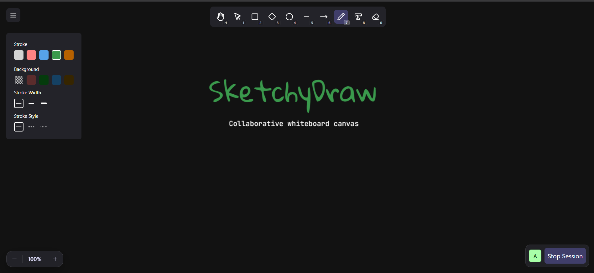

<div align="center">

# ✏️ SketchyDraw

**A real-time collaborative whiteboard with a hand-drawn feel.**
Sketch diagrams, brainstorm and whiteboard together, and see every stroke land on your teammates' screens instantly.

[**Live Demo**](https://sketchydraw.bhagat.dev) · [Architecture](#architecture) · [Getting Started](#getting-started)




</div>

---

## Why this project

SketchyDraw is a full-stack, multiplayer drawing tool built from scratch: a custom infinite canvas, a WebSocket sync layer, JWT auth, a persistent Postgres store, and a containerised deployment. It is a practical exercise in **real-time systems, canvas rendering, and monorepo architecture**.

## Features

**Drawing**
- Ten tools: hand (pan), select, rectangle, diamond, ellipse, line, arrow, freehand, text and eraser
- Sketchy, hand-drawn rendering powered by [rough.js](https://roughjs.com)
- Style panel: stroke colour, width and style (solid, dashed, dotted), fill (solid, hachure, cross-hatch), roughness, and text size, font and alignment
- Select, move and resize shapes, with in-place text editing
- Infinite canvas with pan, and cursor-anchored zoom on wheel and pinch

**Collaboration**
- Live multi-user rooms: strokes, edits and deletions sync to everyone in the room
- Active-participant badge showing who is in the room right now
- Shapes are persisted per room, so late joiners receive the full board on connect
- Standalone mode (`/canvas`): draw locally without an account, no room needed

**Experience**
- Keyboard shortcuts for every tool (see below)
- Touch and pen support through Pointer Events, with pointer capture so multi-touch doesn't corrupt a stroke
- Responsive UI built with Tailwind CSS 4

### Keyboard shortcuts

| Key | Tool | Key | Tool |
|---|---|---|---|
| `H` | Hand (pan) | `5` | Line |
| `1` | Select | `6` | Arrow |
| `2` | Rectangle | `7` | Freehand draw |
| `3` | Diamond | `8` | Text |
| `4` | Ellipse | `0` | Eraser |

## Architecture

```
                    ┌──────────────────────────┐
                    │   Next.js frontend :3000  │
                    │  canvas · zustand · rough │
                    └───────┬───────────┬──────┘
             REST (axios)   │           │   WebSocket (?token=JWT)
                            ▼           ▼
                ┌────────────────┐  ┌────────────────┐
                │ HTTP server    │  │ WS server      │
                │ Express :8000  │  │ ws :8080       │
                │ auth · rooms   │  │ rooms · sync   │
                └───────┬────────┘  └───────┬────────┘
                        └────────┬──────────┘
                                 ▼
                       ┌───────────────────┐
                       │ PostgreSQL        │
                       │ via Prisma        │
                       └───────────────────┘
```

**How a stroke travels**

1. The client finishes a shape and sends `{ type: "chat", roomId, message: shape }` over the socket.
2. The WS server verifies the connection's JWT, upserts the shape in Postgres, keyed on `(roomId, shapeId)`, and broadcasts it to every other socket in that room. A shape of type `deleted` removes the row instead.
3. Receiving clients rebuild the rough.js drawable locally and merge it into their zustand store. Deep-equality checks skip redundant re-renders.
4. On `join-room`, the server replays the room's saved shapes to the new client and broadcasts an updated participant list.

Only shape *data* crosses the wire. Each client generates the hand-drawn geometry itself, which keeps messages small.

### Monorepo layout

```
apps/
  frontend/      Next.js 16 app (App Router), canvas engine, zustand stores
  http-server/   Express REST API: signup, signin, rooms, shape endpoints
  ws/            WebSocket server: room membership, presence, shape sync
packages/
  db/            Prisma schema, migrations and generated client
  common/        Zod schemas shared by client and server
  ui/            Shared React components
  eslint-config/ · typescript-config/   Shared tooling config
```

### Data model

`User` 1—N `Room` (creator) · `User` 1—N `Shape` · `Room` 1—N `Shape`.
Shapes are stored as JSON payloads with a stable client-generated `shapeId`, so updates are idempotent upserts.

### Tech stack

| Layer | Choices |
|---|---|
| Frontend | Next.js 16, React 19, TypeScript, Tailwind CSS 4, zustand (persisted), rough.js, lucide-react |
| Backend | Node.js, Express, `ws`, JSON Web Tokens, bcrypt, Zod |
| Data | PostgreSQL, Prisma ORM with migrations |
| Tooling | pnpm workspaces, Turborepo, ESLint, Prettier |
| Deploy | Docker (one image per service), Docker Compose, nginx-proxy |

## Getting started

**Prerequisites:** Node.js ≥ 18, pnpm 9, and a PostgreSQL database.

```bash
# 1. Install
git clone <this-repo-url> && cd sketchyDraw
pnpm install

# 2. Configure environment (see table below)
cp packages/db/.env.example        packages/db/.env
cp apps/http-server/.env.example   apps/http-server/.env
cp apps/ws/.env.example            apps/ws/.env
cp apps/frontend/.env.example      apps/frontend/.env

# 3. Set up the database
pnpm --filter @repo/db generate
pnpm --filter @repo/db migrate

# 4. Build shared packages, then run everything
pnpm build
pnpm dev
```

Then open <http://localhost:3000>.

> The backend services import the compiled output of `packages/db` and `packages/common`, so run `pnpm build` at least once before starting them.

### Environment variables

| Variable | Used by | Purpose |
|---|---|---|
| `DATABASE_URL` | db, http-server, ws | PostgreSQL connection string |
| `JWT_SECRET` | http-server, ws | Signs and verifies auth tokens (must match) |
| `EC2_INSTANCE_URL` | http-server | Extra allowed CORS origin for deployment |
| `NEXT_PUBLIC_HTTP_URL` | frontend | Base URL of the REST API, e.g. `http://localhost:8000` |
| `NEXT_PUBLIC_WS_SERVER_URL` | frontend | WebSocket URL, e.g. `ws://localhost:8080` |

### Run with Docker

```bash
docker compose up --build
```

This starts the frontend (3000), HTTP API (8000), WebSocket server (8080) and an nginx reverse proxy (80).

## API overview

| Method | Route | Auth | Description |
|---|---|---|---|
| `POST` | `/signup` | – | Create an account (bcrypt-hashed password) |
| `POST` | `/signin` | – | Returns a JWT |
| `POST` | `/room` | JWT | Create a room |
| `GET` | `/rooms` | JWT | List rooms you own |
| `DELETE` | `/room` | JWT | Delete a room (owner only) |
| `POST` | `/bulkShapes/:roomId` | JWT | Save a batch of shapes, e.g. when promoting a local canvas to a room |
| `GET` | `/shapes/:roomId` | – | Fetch a room's shapes |

**WebSocket messages:** `join-room` · `leave-room` · `chat` (shape create, update or delete) · `participants-update` (server → client).

## What I learned / engineering highlights

- **Real-time sync design:** a small message protocol with server-authoritative persistence, idempotent shape upserts and per-room broadcast fan-out.
- **Canvas engine from scratch:** hit-testing, resize handles, zoom and pan transforms, and in-place text editing on a raw `<canvas>`.
- **Input handling:** unified mouse, touch and pen through Pointer Events with pointer capture.
- **Monorepo discipline:** shared Zod validation across client and server, shared TS and ESLint configs, and Turborepo task caching.
- **Deployment:** multi-stage Docker builds per service, orchestrated with Compose behind nginx.

## Roadmap

- [ ] Undo / redo history
- [ ] Export to PNG / SVG
- [ ] Live remote cursors
- [ ] Room sharing with access control
- [ ] Automated tests and CI

## License

MIT (add a `LICENSE` file if you plan to publish).

---

<div align="center">Built by <b>Rakesh Bhagat</b> · <a href="https://sketchydraw.bhagat.dev">sketchydraw.bhagat.dev</a></div>
